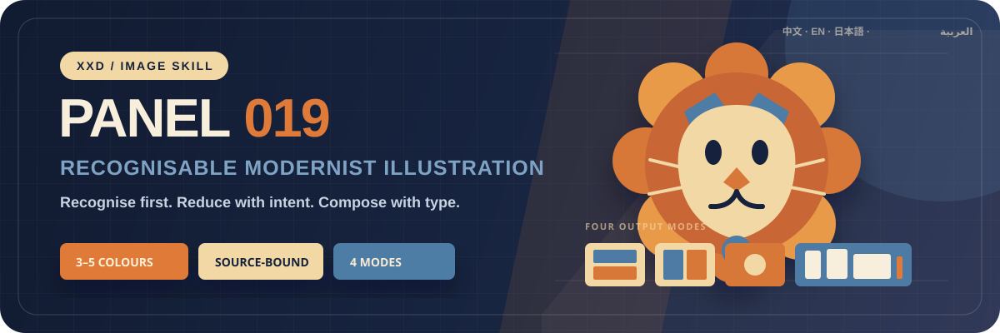

<p align="center">
  
</p>

<div align="center">

# 🦁 XXD Panel 019

### 写真固有の被写体と関係を、見分けられるままモダニズム・イラストへ再構成する

[](./SKILL.md)
[](#4つの出力を支えるひとつの認識ロジック)
[](#境界と信頼性)

<a href="README.md">简体中文</a> · <a href="README.en.md">English</a> · <strong>日本語</strong>

</div>

> RECOGNISE FIRST · REDUCE WITH INTENT · COMPOSE WITH TYPE

XXD Panel 019 は、Codex と互換 Agent のための画像生成 Skill です。写真の被写体、姿勢、方向、比率、切り離せない関係を、判別可能なレトロモダニズムの平面イラストへ翻訳します。写真の自動トレースでも、一般的な幾何学で内容を消す仕組みでもありません。

減らすべきなのはノイズであり、固有性ではありません。

## なぜ、この Skill が必要なのか

写真を平面イラストへ変換する多くの手法は、やがて共通の道具箱へ収束します。人物は顔のないシルエットになり、実在する場所は太陽と道路へ変わり、色はテンプレートから選ばれ、文字は余白を埋める装飾になります。デザインには見えても、その写真の作品ではなくなります。

019 は、すべての変換画面に少なくとも三つの元写真固有の手がかりを求めます。外形、姿勢、方向、比率、重なり、負形、被写体間の距離などです。幾何学的な再構成は大胆でも、どの場面を語り直しているのかが一目で分からなければなりません。

```text
元写真 → 被写体と関係を特定 → 識別手がかりを固定 → 3–5 色を抽出 → 再構成 → 組版 → 検証
```

## 019 のビジュアル原則

- **まず識別**：グラフィックな緊張感より先に、被写体と関係を守ります。
- **少なくとも三つの手がかり**：輪郭、姿勢、比率、方向、重なり、負形を組み合わせます。
- **元写真由来の 3–5 色**：作例やテンプレートの色を持ち込みません。
- **正負形とスケール差**：大きな色面、硬質な切面、簡潔な曲線、余白で視線を導きます。
- **抑制された印刷感**：軽い網点、紙、版ずれを平面階層へ使い、滑らかな 3D 表現にはしません。
- **編集的タイポグラフィ**：見出しとマイクロコピーを幾何学、重心、空間リズムへ参加させます。

## 4つの出力を支える、ひとつの認識ロジック

モードが未指定なら、Skill が最初に確認します。サイズも同時に指定でき、正確なピクセル値が最優先です。

| モード | サイズ方針 | 出力 |
| --- | ---: | --- |
| `top-bottom` | 元画像に適応 | 上に元写真、下に 019 イラスト。各パネルは元画像全体のサイズを保ち、高さを厳密に 50/50 分割 |
| `left-right` | 元画像に適応 | 左に元写真、右に 019 イラスト。各パネルは元画像全体のサイズを保ち、幅を厳密に 50/50 分割 |
| `design-only` | 元画像に適応 | 元写真を表示しない一枚の完成イラスト。元画像の比率とサイズを継承 |
| `wallpaper-pack` | 端末別4サイズ | スマートフォン、iPad、デスクトップ、子ども向け腕時計の個別 PNG |

二分割モードの写真は現実の写真として保ち、控えめな色調整と必要最小限の背景拡張だけを許可します。単画面と壁紙では、写真は被写体、関係、色、コピーの根拠として使われますが、完成画像には現れません。

### 壁紙セット：同じ家族であって、同じ一枚ではない

壁紙セットには暗黙の既定サイズを使いません。共通端末プリセット（スマートフォン `1440×3200`、iPad `2048×2732`、デスクトップ `3840×2160`、腕時計 `1024×1024`）を選ぶか、端末別の解像度を指定します。

- **連続セット（推奨）**：まず iPad 用の基準画像を生成・検証し、残りの三枚は「元写真＋同じ基準画像」を参照して各端末へ再構成します。
- **4枚を独立制作**：各端末が元写真だけを参照し、より自由に構図を探索します。

連続セットは色、図形文法、印刷感、組版リズムを共有しますが、被写体位置、幾何学的階層、文字、安全領域は端末ごとに解き直します。一枚の切り抜きでも、順番に参照を渡す方式でもありません。

## コピーは画面固有でなければならない

生成前に、自動コピー、カスタムコピー、文字なしのいずれかを確認します。自動／カスタムでは対象言語または地域も指定し、カスタムでは見出しと任意のマイクロコピーを直接入力できます。

タイトルは無関係な写真との入れ替えテストを通過する必要があります。別の写真でも同じように成立するなら、この作品の言葉ではありません。マイクロコピーも同じ意味の核を延長し、無関係なシリアル番号や擬似アーカイブ語で余白を埋めません。

完成原稿は一字一句保持します。方向性や編集可能な草稿は、読者、目的、必須語句、語調、含意を守っている範囲でだけ転創します。

言語の優先順位：

```text
対象市場・読者 > 指定された出力言語 > コピー方針の言語；いずれも明示されていない場合は生成前に確認
```

日本版は自然な日本語と日本語の禁則処理、韓国版は自然な韓国語と正しい空白、英国版はイギリス英語を使います。外見から国籍を推測せず、擬似外国語も使いません。

## 分割精度はスクリプトへ。イラストは画像生成へ

`scripts/compose_panel.py` は設計、厳密な 50/50 のラスタ合成、最終サイズ、監査を担当します。SVG やプログラム生成の色面で、本来のビットマップ生成を代用しません。

```bash
python3 scripts/compose_panel.py --plan --layout top-bottom --source photo.png
python3 scripts/compose_panel.py --plan --layout left-right --size 2560x1440
python3 scripts/compose_panel.py --audit result.png --layout design-only --size 2048x2048
```

上下分割はキャンバス全高、左右分割は全幅が偶数である必要があります。奇数の指定を黙って書き換えることはありません。

## はじめる

```bash
git clone https://github.com/nevertoday/xxd-panel-019.git
mkdir -p ~/.codex/skills
ln -s "$(pwd)/xxd-panel-019" ~/.codex/skills/xxd-panel-019
```

Claude Code では同じフォルダーを `~/.claude/skills/xxd-panel-019` へリンクできます。インストール後は Agent セッションを再起動してください。

```text
$xxd-panel-019
この写真から4端末向けの連続壁紙セットを作ってください。見出しはイギリス英語で。
```

写真だけを添えて Skill を呼び出すこともできます。その場合は、改行された番号付きメニューでモードを確認し、壁紙セットなら必要に応じて「連続セット」か「4枚を独立制作」かを続けて確認します。

完全な仕様：

- [Skill ワークフロー](SKILL.md)
- [中国語版フルプロンプト](references/xxd-panel-019-prompt.zh-CN.md)
- [英語版フルプロンプト](references/xxd-panel-019-prompt.en.md)

## 境界と信頼性

- 現在の写真だけが現在のタスクの内容ソースです。別入力、過去成果、同梱例から内容を借りません。
- 同じ写真と同じパラメータでも、呼び出しごとに新しいタスクフォルダーを作ります。
- 最終成果は PNG ビットマップです。SVG、HTML、Canvas、プログラム描画で代用しません。
- 設定済みビットマップブリッジは匿名化した状態だけを返し、provider、endpoint、header、credential、Prompt、サーバー応答本文を表示しません。
- 通常モードは一枚、壁紙モードは四つの独立ファイルを返し、一覧用コラージュへまとめません。

ローカル合成には Python 3 と Pillow が必要です。安全なビットマップブリッジは Python 3.11+ の `tomllib` を使用します。実際の生成には、ホスト Agent の内蔵ビットマップ生成機能、または設定済みの互換ルートが必要です。

## リポジトリ構成

```text
xxd-panel-019/
├── SKILL.md
├── README.md / README.en.md / README.ja.md
├── agents/openai.yaml
├── assets/banner.svg
├── scripts/
│   ├── compose_panel.py
│   └── configured_imagegen.py
└── references/
    ├── xxd-panel-019-prompt.zh-CN.md
    └── xxd-panel-019-prompt.en.md
```

## XXD について

XXD は Xiaoxiaodong のブランド名を略したものです。このプロジェクトは [@xiaoxiaodong01](https://x.com/xiaoxiaodong01) が制作・管理しています。

## サポートと会員特典

### Skills Q&A｜CNY 99

この料金は Skills の利用に関する Q&A サポート向けです。購入またはお問い合わせは、以下の WeChat QR コードから Xiaoxiaodong へご連絡ください。

### 知识星球＋会員向けプロンプトライブラリ｜年額 CNY 699

知识星球と [XXD 会員向けプロンプトライブラリ](https://vip.xiaoxiaodong.ai/)は、ひとつの会員特典です。**年額料金を一度支払えば両方を利用でき、二重に購入する必要はありません。**

登録方法は、次のどちらかを選べます。

1. [知识星球](https://wx.zsxq.com/group/15554814142882)で登録後、WeChat で Xiaoxiaodong に連絡し、会員向けプロンプトライブラリの引換コードを受け取る。
2. [会員向けプロンプトライブラリ](https://vip.xiaoxiaodong.ai/)で直接登録後、WeChat で Xiaoxiaodong に連絡し、知识星球への招待を受ける。

<p align="center">
  <a href="https://xiaoxiaodong.pages.dev/assets/wechat-qr.png"></a>
</p>

<div align="center">

**画面を簡潔にしても、その固有性までは削らない。**

</div>

---

<div align="center">
  <h2>☕ このオープンソースプロジェクトを応援する</h2>
  <p>このプロジェクトが役立ったら、Star、シェア、またはコーヒー一杯で応援していただけるとうれしいです。</p>
  <table>
    <tr>
      <td align="center" width="240">
        <a href="https://github.com/nevertoday/zhongguo-traditional-colors/blob/main/docs/images/buy-me-a-coffee-qr.png?raw=true"></a><br>
        <strong>Buy me a coffee</strong><br>
        <sub>QR コードを読み取るか開いて、Xiaoxiaodong を応援できます</sub>
      </td>
    </tr>
  </table>
  <p><sub>支援は任意であり、このオープンソースプロジェクトの利用条件には影響しません。</sub></p>
</div>
