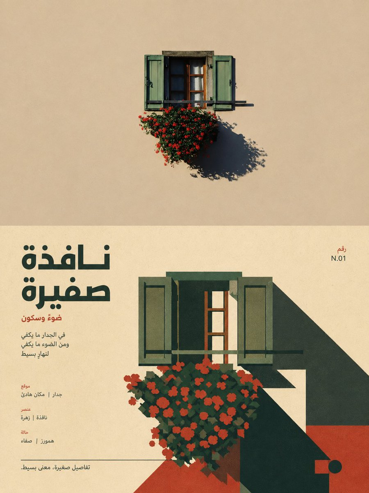
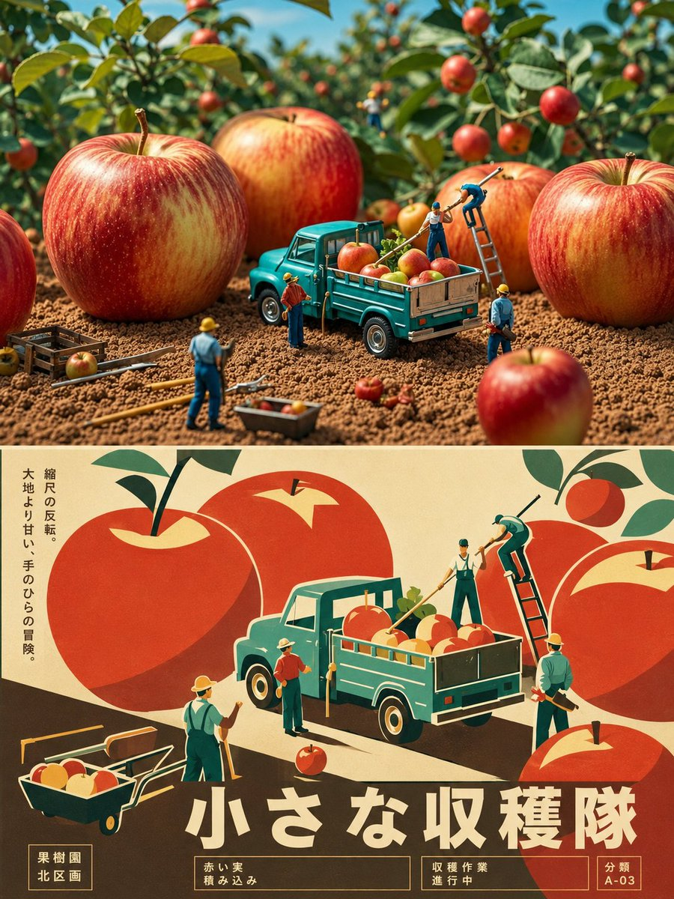
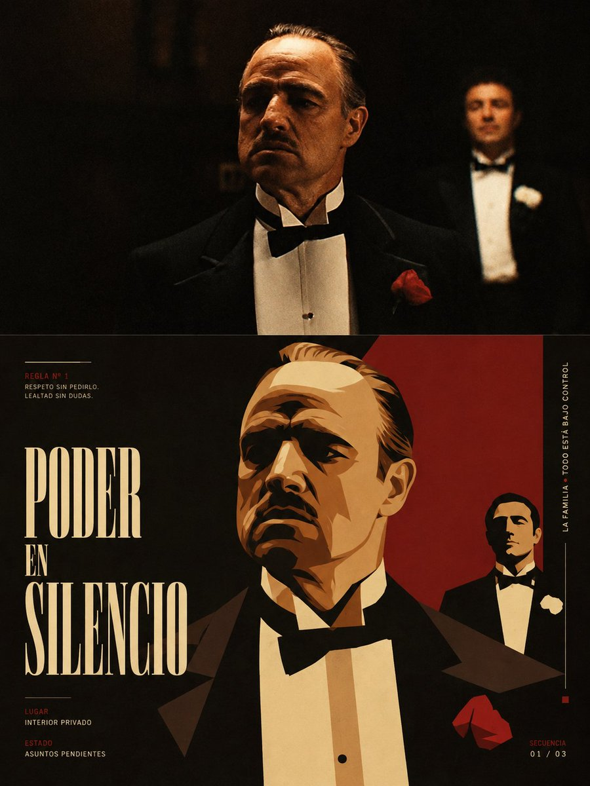

<p align="center">
  
</p>

<div align="center">

# 🦁 XXD Panel 019

### 把照片中的特定主体与关系，重构成一张仍然认得出来的现代主义插画

[](./SKILL.md)
[](#四种输出共享同一种识别逻辑)
[](#边界与信任)

<strong>简体中文</strong> · <a href="README.en.md">English</a> · <a href="README.ja.md">日本語</a> · <a href="README.ko.md">한국어</a> · <a href="README.ar.md">العربية</a>

</div>

> RECOGNISE FIRST · REDUCE WITH INTENT · COMPOSE WITH TYPE

XXD Panel 019 是一个面向 Codex 与兼容 Agent 的图像生成 Skill。它把照片里的主体、姿态、方向、比例和不可拆分关系，转译成可辨认的复古现代主义平面插画；它不是把照片描摹成矢量，也不是用几何色块把内容抹掉。

简化不是删除身份，而是找到最少但足够准确的证据。

## 为什么需要它

很多“照片转平面插画”最后只剩一套通用语法：人物变成无脸剪影，场景变成太阳和道路，配色来自模板，文字只是装饰。结果看起来像设计，却不再属于原照片。

019 要求每张变化画面保留至少三个源图专属身份线索，例如外轮廓、姿态、朝向、比例、遮挡、负形或主体之间的距离。几何化可以大胆，但观众仍应一眼认出它在重新讲述哪一个画面。

```text
源照片 → 找到主体与关系 → 锁定身份线索 → 提取 3–5 色 → 几何重构 → 编辑排版 → 精确复核
```

## 019 的视觉承诺

- **辨识优先**：先保证主体和关系仍能对应原照片，再追求形式张力。
- **至少三个身份线索**：轮廓、姿态、比例、方向、遮挡与负形共同建立识别。
- **3–5 个源图颜色**：颜色来自照片，不借用示例作品或模板色盘。
- **正负形与尺度反差**：用大色面、切面、简洁曲线和留白建立观看路径。
- **克制的印刷气质**：轻微网点、纸感和套印特征服务于平面层级，不模拟光滑 3D。
- **编辑式文字**：标题与微型文字参与几何关系、视觉重心和空间节奏。

## 样张 · 来自 X

> [小小东（@xiaoxiaodong01）](https://x.com/xiaoxiaodong01/status/2090144142366233008) · 2026 年 8 月 19 日<br>
> GPT2 × 复古 × 扁平 × 美学提示词 × VOL.019<br>
> 推文同时演示：在提示词中注明“语言偏好：西班牙语”等目标语言，文字会跟随受众语言自然转创。

<table>
  <tr>
    <td width="50%"><a href="https://x.com/xiaoxiaodong01/status/2090144142366233008"></a></td>
    <td width="50%"><a href="https://x.com/xiaoxiaodong01/status/2090144142366233008"></a></td>
  </tr>
  <tr>
    <td width="50%"><a href="https://x.com/xiaoxiaodong01/status/2090144142366233008"></a></td>
    <td width="50%"><a href="https://x.com/xiaoxiaodong01/status/2090144142366233008"></a></td>
  </tr>
</table>

<p align="center"><a href="https://x.com/xiaoxiaodong01/status/2090144142366233008">查看原推文与完整提示词 →</a></p>

这些样张用于展示 019 的美学动机，不会把推文中的旧画幅写成当前 Skill 的默认尺寸；当前四种模式仍遵循下方的源图自适应与自定义尺寸逻辑。

## 四种输出，共享同一种识别逻辑

四种模式支持单选或多选。可回复 `1`、`1+3`、`1、2、4` 或 `全部`；Skill 去重后按 1→4 执行。每种模式独立输出并进入独立子文件夹，不制作总图；`全部` 每张原图得到 7 个 PNG（前三种各 1 张＋壁纸 4 张）。尺寸可在同一回复中按模式标注，未标注普通模式按源图适配；文案默认跨所选模式共用，也可按模式单独指定。

| 模式 | 尺寸逻辑 | 成品 |
| --- | ---: | --- |
| `top-bottom` | 源图自适应 | 原照片在上，019 插画在下，每格保留完整原图尺寸，严格等高 |
| `left-right` | 源图自适应 | 原照片在左，019 插画在右，每格保留完整原图尺寸，严格等宽 |
| `design-only` | 源图自适应 | 只保留变化后的完整插画，不显示原照片，沿用源图比例与尺寸 |
| `wallpaper-pack` | 四种设备尺寸 | 手机、iPad、电脑、儿童手表各一张独立 PNG |

双联中的摄影保持真实，只允许克制调色和必要的环境延展。单画面与壁纸中，照片仅作为主体、关系、配色与文案的依据，不进入最终画面。

### 四端壁纸：同一家族，不是同一张图

壁纸套装不会静默套用尺寸。选择“常用设备预设”时使用手机 `1440×3200`、iPad `2048×2732`、电脑 `3840×2160`、儿童手表 `1024×1024`；也可以逐设备自定义。

- **连贯套装（推荐）**：先生成并验收 iPad 定调图；另外三张都使用“原照片＋同一张定调图”重新构图。
- **四张独立**：每张只参考原照片，让不同设备拥有更自由的解法。

连贯套装锁定色盘、图形语法、印刷气质和排版节奏，但每个设备仍要重新求解主体位置、几何层级、文字和安全区。不会机械裁切，也不会串联垫图造成逐张漂移。

## 文案必须与画面高度绑定

文字不再静默开启。正式生图前先选择自动文案、自定义文案或无文字，并为前两者注明目标语言或地区。自动文案不会从“Memory / Dream / Journey”一类通用词中抽取，而是先读取画面的事实、关系张力和有依据的潜台词，再寻找一个让观众重新看懂照片的标题。

标题要通过“换图测试”：换到无关照片仍然成立，就说明它不属于当前作品。微型文字必须延续同一个语义核心，不能为了排版随意堆序列号或伪档案标签。

用户给出最终成稿时逐字保留；给出方向或可编辑草稿时，Skill 会理解受众、目的、必留词、语气和暗示，再在授权范围内专业转创。

文案语言优先级：

```text
目标市场／受众地区 > 指定成品语言 > 文案方向语言；以上均未明确时，生图前询问
```

日本版使用自然日语与日文断行规则，韩国版使用自然韩语与正确空格，英国版使用英式英语，阿拉伯语版使用自然的现代标准阿拉伯语、正确连写和从右到左排版。Skill 不从人物外貌推断国籍，也不使用伪外文。

## 准确分区由脚本完成，插画仍由生图完成

`scripts/compose_panel.py` 负责规划、严格 50/50 合成、最终尺寸和审计。它不会用 SVG 或程序化色块替代真正的位图生图。

```bash
python3 scripts/compose_panel.py --plan --layout top-bottom --source photo.png
python3 scripts/compose_panel.py --plan --layout left-right --size 2560x1440
python3 scripts/compose_panel.py --audit result.png --layout design-only --size 2048x2048
```

精确上下双联要求总高度为偶数，左右双联要求总宽度为偶数；奇数尺寸不会被静默改写。

## 开始使用

### 安装

```bash
git clone https://github.com/nevertoday/xxd-panel-019.git
mkdir -p ~/.codex/skills
ln -s "$(pwd)/xxd-panel-019" ~/.codex/skills/xxd-panel-019
```

Claude Code 用户可链接到 `~/.claude/skills/xxd-panel-019`。安装后重新开启 Agent 会话。

### 调用

```text
$xxd-panel-019
把这张照片做成四端连贯壁纸套装，主标题使用英式英语。
```

只上传照片并调用也可以；Skill 会先用分行编号菜单询问一个或多个模式。壁纸模式未说明关系时，再询问“连贯套装”或“四张独立”。

完整生成规范：

- [Skill 工作流](SKILL.md)
- [中文完整提示词](references/xxd-panel-019-prompt.zh-CN.md)
- [English full prompt](references/xxd-panel-019-prompt.en.md)
- [019 原始风格提示词](references/019-source.md)

## 边界与信任

- 当前照片是当前任务唯一的内容来源，不借用其他输入、旧成品或示例素材。
- 每次调用新建任务目录；相同照片与相同参数也必须重新生成。
- 最终交付为 PNG 位图，不用 SVG、HTML、Canvas 或程序化绘图冒充。
- 位图桥接器只返回脱敏状态，不打印 provider、端点、请求头、凭据、Prompt 或服务端正文。
- 每个所选普通模式各返回一张；若选择 `wallpaper-pack`，再返回四张独立壁纸。选择 `全部` 时每张原图共返回 7 个 PNG，分处四个同级模式文件夹，绝不生成拼贴总览。

本地合成需要 Python 3 与 Pillow；安全位图桥接器使用 Python 3.11+ 的 `tomllib`。实际生成需要宿主 Agent 的内置位图能力，或已配置好的兼容位图路径。

## 仓库结构

```text
xxd-panel-019/
├── SKILL.md
├── README.md / README.en.md / README.ja.md / README.ko.md / README.ar.md
├── agents/openai.yaml
├── assets/banner.svg
├── scripts/
│   ├── compose_panel.py
│   └── configured_imagegen.py
└── references/
    ├── xxd-panel-019-prompt.zh-CN.md
    ├── xxd-panel-019-prompt.en.md
    └── 019-source.md
```

## 关于 XXD

XXD 是小小东的品牌名缩写。本项目由 [@xiaoxiaodong01](https://x.com/xiaoxiaodong01) 创作与维护。

## 支持与会员权益

### 深度咨询｜299 元/小时

按小时提供一对一 Skills 深度咨询，每小时 299 元。如需预约，请扫描下方微信二维码联系小小东。

### 小小东 Skills 用户交流群｜入群 99 元

一次付费加入用户交流群，用于 Skills 使用经验分享、作品交流与成员互助；不包含按小时的一对一深度咨询。入群请扫描下方微信二维码，备注「Skills 用户群」。

### 知识星球＋成员提示词库｜699 元/年

知识星球与 [XXD 成员提示词库](https://vip.xiaoxiaodong.ai/)属于同一项会员权益：**支付一次年费，两项同时开通，不需要重复付费。**

任选一种开通方式：

1. 在[知识星球](https://wx.zsxq.com/group/15554814142882)开通后，微信联系小小东，领取成员提示词库兑换码。
2. 在[成员提示词库](https://vip.xiaoxiaodong.ai/)自助开通后，微信联系小小东，由小小东邀请进入知识星球。

<p align="center">
  <a href="https://xiaoxiaodong.pages.dev/assets/wechat-qr.png"></a>
</p>

<div align="center">

**简化画面，但不简化它的身份。**

</div>

---

<div align="center">
  <h2>⚡ 算力赞助</h2>
  <p>如果这个项目为你节省了时间，欢迎点亮 Star、分享给朋友，或自愿赞助项目算力。</p>
  <table>
    <tr>
      <td align="center" width="240">
        <a href="https://colors.xiaoxiaodong.ai/docs/images/wechat-reward-qr.png"></a><br>
        <strong>微信</strong><br>
        <sub>扫描二维码赞助算力</sub>
      </td>
      <td align="center" width="240">
        <a href="https://colors.xiaoxiaodong.ai/docs/images/alipay-reward-qr.png"></a><br>
        <strong>支付宝</strong><br>
        <sub>扫描二维码赞助算力</sub>
      </td>
    </tr>
  </table>
  <p><sub>算力赞助完全自愿，用于支持生成测试与项目持续维护，不影响项目的免费使用。</sub></p>
</div>
